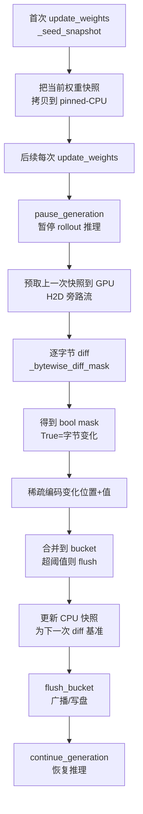
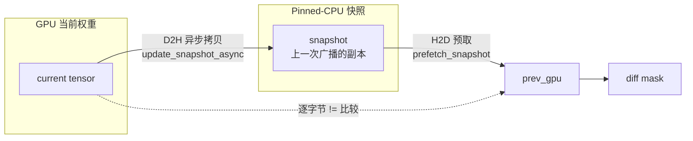
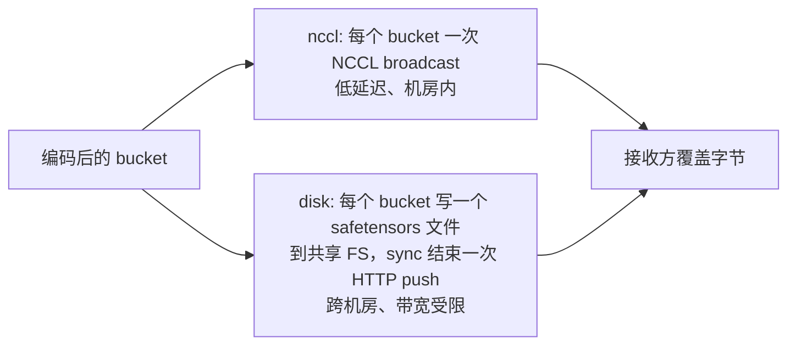

#### 8.1.1 Delta Weight 的识别机制（深入）

slime 的 Delta Weight Sync 通过**逐字节 diff（bytewise diff）**来识别"哪些权重字节发生了变化"，只传输变化部分。核心逻辑在 `slime/backends/megatron_utils/update_weight/update_weight_from_distributed_delta.py`。

**整体识别流程：**



**① 识别的核心：逐字节 diff**

这是"识别 delta"的**唯一判据**。代码在 `_bytewise_diff_mask`：

```python
def _bytewise_diff_mask(current: torch.Tensor, snapshot: torch.Tensor) -> torch.Tensor:
    es = current.element_size()
    int_dtype = {1: torch.uint8, 2: torch.int16, 4: torch.int32, 8: torch.int64}.get(es)
    return current.view(int_dtype) != snapshot.view(int_dtype)
```

- **不关心 dtype 语义**（不做浮点比较），而是把 tensor **按字节宽度 reinterpret 成整数**，然后做 `!=` 比较。
- 一个元素只要**任意一个字节**不同，mask 对应位置就是 `True`——**保守、无遗漏**。
- 配对的 snapshot 存在于 pinned-CPU（`DeltaState.snapshot`），通过 H2D 拷到 GPU 上做批量比较。

**② 维护 diff 基准（DeltaState）**

要 diff，必须记住"上一次广播时的权重长什么样"。`DeltaState` 负责这个：



- **首次调用**（`_snapshot_seeded=False`）：`_seed_snapshot` 把当前权重整份拷到 CPU 快照，**不联系 rollout 引擎**（假设它们已加载相同 HF checkpoint）。
- **后续每次**：以这份快照为基准做 diff，diff 完后立即 `update_snapshot_async` 把当前权重写回快照，作为下一次的基准。
- 用 `d2h_stream`/`h2d_stream` 两条旁路 CUDA 流，把快照的 H2D 预取和当前 chunk 的计算**重叠流水**（`_pipeline_pass` 的 1-step lookahead）。

**③ 从 mask 到可传输的稀疏编码**

mask 只是"哪些位置变了"。要传给接收方，需要把**变化的位置 + 变化后的值**打包。三种编码（`--update-weight-encoding`）共享一套 wire 格式（`__positions__` uint8 blob + `__values__` tensor + per-param manifest），仅位置打包方式不同：

| 编码 | 位置打包方式 | 适用 |
|------|------------|------|
| `indices` | int32 **绝对位置** | 简单，pos_width 固定 4 |
| `deltas` | uint16 **间隔差**（`idx[k]-idx[k-1]-1`），最大间隔超 65535 则回退 uint32 | bf16 ~2% 密度时更省带宽 |
| `deltas_zstd` | `deltas` + safetensors blob 外层 zstd 压缩 | disk 跨机房传输 |

`encode_deltas` 的间隔编码逻辑（接收方逆变换 `idx = cumsum(delta + 1) - 1`）：

```python
# idx[-1] := -1，所以第一个 delta = 第一个索引本身
prev = torch.cat([torch.tensor([-1], ...), local_idx[:-1]])
per_param_deltas.append(local_idx - prev - 1)
```

每个参数独立编码，记录在 `DeltaParam` 里（`pos_start/pos_end/pos_width` 描述位置 blob 切片，`val_start/val_end` 描述值切片）。

**④ 接收方如何"无损"应用**

接收方（SGLang 引擎）拿到 `__positions__` + `__values__` + `DeltaSpec` 后，**直接用训练方的字节覆盖变化位置**——不做任何算术运算。源码注释明确：

> The receiver overwrites changed positions with the trainer's exact bytes (no arithmetic), so the apply is lossless and there is no drift to fight with periodic re-syncs.

因此**不需要周期性全量重同步来纠正漂移**——因为不存在累加误差。

**⑤ 完整性校验（防传输损坏）**

每次 flush 前发送方算 checksum，接收方应用后再算一次比对（`_checksum`）：

```python
def _checksum(positions, values):
    p = int(torch.hash_tensor(positions).item()) if positions.numel() else 0
    v = int(torch.hash_tensor(values).item()) if values.numel() else 0
    return p ^ (v << 1)
```

用 `torch.hash_tensor` 做 uint64 XOR 归约，一次 reduction + 一次 `.item()` 同步即可。不匹配即判定 encode→apply 之间发生损坏。

**⑥ 两种传输通道**

识别出来的 delta（同一个 wire 格式）走两条路（`--update-weight-transport`）：



- **nccl**：`_update_bucket_weights_from_distributed` 直接广播 `__positions__`/`__values__` + `DeltaSpec`。
- **disk**：写成 `rank{N}_flush{M}.safetensors`，metadata 里带 encoding/params/version/checksum，sync 结束 rank 0 聚合所有文件名后一次性 `update_weights_from_disk` RPC 唤醒引擎读取。支持 `--custom-delta-pre-push-path` 钩子做异步持久化，并用 `ThreadPoolExecutor` 把 RPC 推迟到持久化完成之后，让主编码线程不阻塞。

**⑦ 关键设计取舍**

| 设计 | 原因 |
|------|------|
| **字节级 diff 而非浮点 diff** | 任意字节变化都能捕获；避免浮点 == 不可靠问题；dtype 无关 |
| **快照存 CPU pinned** | 不占 GPU 显存；H2D/D2H 用旁路流与计算重叠 |
| **首次不广播，只建快照** | 训练方和 rollout 方都从同一 HF checkpoint 初始化，首次无需同步 |
| **接收方覆盖而非累加** | 无损、无漂移，免除周期性全量重同步 |
| **bucket + flush 阈值** | 控制 NCCL broadcast 单次大小 / disk 单文件大小 |
| **专家参数分 4 个 sub-pass** | 让前一批专家的接收方 apply 与后续专家编码重叠，避免 end-of-sync 瓶颈 |
| **checksum 校验** | 防止 wire/disk 损坏导致静默权重不一致 |

**⑧ 相关参数**

| 参数 | 作用 |
|------|------|
| `--update-weight-transport` | `nccl` 或 `disk` |
| `--update-weight-encoding` | `indices` / `deltas` / `deltas_zstd` |
| `--update-weight-buffer-size` | bucket flush 的字节阈值 |
| `--update-weight-disk-dir` | disk 模式的共享 FS 目录 |
| `--update-weight-delta-keep-files` | 是否保留 delta 文件（调试用） |
| `--custom-delta-pre-push-path` | disk 模式 push 前的异步持久化钩子 |

> 核心代码位置：`slime/backends/megatron_utils/update_weight/update_weight_from_distributed_delta.py`（`_bytewise_diff_mask` 是识别 delta 的关键，`DeltaState` 维护 diff 基准，`encode_indices`/`encode_deltas` 负责稀疏编码）。
