# slime — 详细技术 Wiki

> **slime** 是一个面向强化学习规模扩展的 LLM 后训练框架，核心目标：高性能训练 + 灵活数据生成。  
> 官方文档：https://thudm.github.io/slime/ | 版本：0.3.0

---

## 目录

1. [项目概览](#1-项目概览)
2. [高层架构](#2-高层架构)
3. [核心模块详解](#3-核心模块详解)
   - [Training 模块（Megatron）](#31-training-模块megatron)
   - [Rollout 模块（SGLang）](#32-rollout-模块sglang)
   - [Data Buffer](#33-data-buffer)
   - [Ray 编排层](#34-ray-编排层)
4. [训练主循环](#4-训练主循环)
5. [核心数据类型](#5-核心数据类型)
6. [定制化接口](#6-定制化接口)
7. [部署模式](#7-部署模式)
8. [高级特性](#8-高级特性)
9. [插件系统](#9-插件系统)
10. [生态项目](#10-生态项目)
11. [配置指南](#11-配置指南)
12. [测试与 CI](#12-测试与-ci)
13. [目录结构](#13-目录结构)

---

## 1. 项目概览

slime 由清华大学 THUDM 实验室开发，是 GLM-5、GLM-4.x 等前沿模型 RL 后训练的核心基础设施。

### 设计哲学

```
correctness-first  →  native pass-through  →  lightweight & opinionated
```

| 原则 | 说明 |
|------|------|
| **正确性优先** | RL bug 往往是无声的。slime 保持数据流显式可见，支持独立的 rollout-only / train-only 调试路径 |
| **原生直通** | Megatron 参数直接传递；SGLang 参数加 `--sglang-` 前缀即可使用 |
| **轻量且专注** | 深度优化 Megatron + SGLang 这一路径，不做多引擎最大公约数抽象 |
| **最大数据生成自由度** | 数学/代码/搜索/工具/沙盒/验证器/多智能体均通过数据生成接口插入，不修改训练核 |

### 已验证模型

- **GLM 系列**：GLM-5.2, 5.1, 5, 4.7, 4.6, 4.5
- **Qwen 系列**：Qwen3.6, 3.5, 3Next, 3MoE, 3, 2.5
- **DeepSeek 系列**：V3, V3.1, R1
- **Llama 3**

---

## 2. 高层架构

### 2.1 系统全局架构

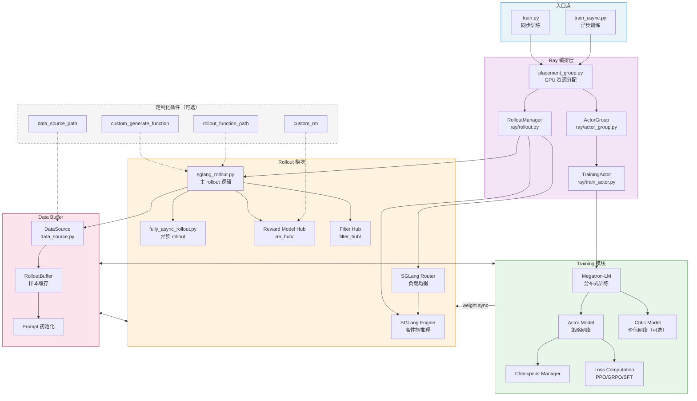

### 2.2 三大核心模块交互

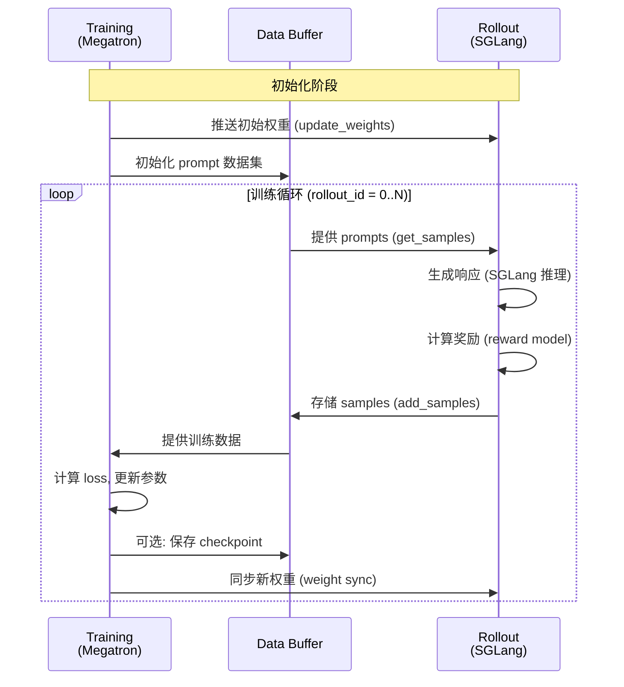

---

## 3. 核心模块详解

### 3.1 Training 模块（Megatron）

基于 Megatron-LM 实现分布式大模型训练，支持多种并行策略。

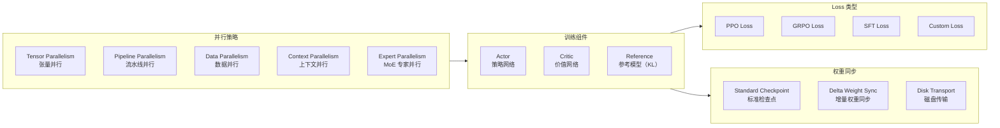

**关键文件**：

| 文件 | 说明 |
|------|------|
| `slime/backends/megatron_utils/actor.py` | Megatron 训练 Actor 实现 |
| `slime/backends/megatron_utils/loss.py` | PPO/GRPO/SFT loss 计算 |
| `slime/backends/megatron_utils/model.py` | 模型定义 |
| `slime/backends/megatron_utils/checkpoint.py` | checkpoint 管理 |
| `slime/backends/megatron_utils/data.py` | 数据加载（与 Data Buffer 对接） |
| `slime/utils/ppo_utils.py` | PPO 算法核心实现（729 行） |
| `slime/utils/mask_utils.py` | Token 级 loss mask 计算 |

### 3.2 Rollout 模块（SGLang）

基于 SGLang 实现高性能推理与数据生成。

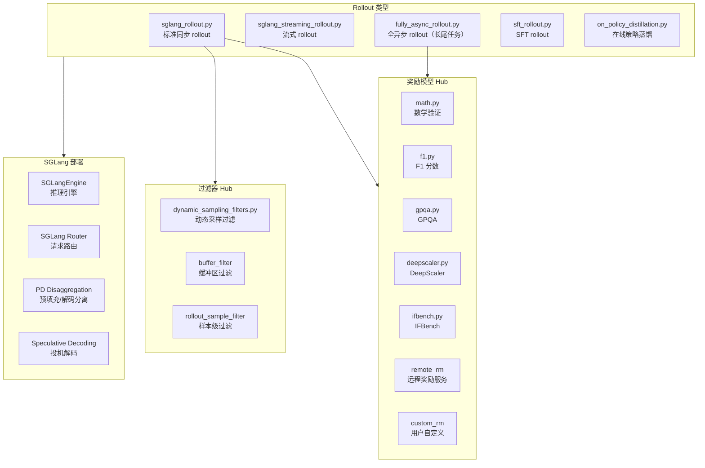

**关键文件**：

| 文件 | 说明 |
|------|------|
| `slime/rollout/sglang_rollout.py` | 主 rollout 实现（609 行） |
| `slime/rollout/fully_async_rollout.py` | 全异步 rollout（适合长尾 agent 任务） |
| `slime/rollout/data_source.py` | 数据源抽象层 |
| `slime/backends/sglang_utils/sglang_engine.py` | SGLang 引擎封装 |
| `slime/backends/sglang_utils/sglang_config.py` | YAML 拓扑配置 |
| `slime/backends/sglang_utils/server_control.py` | 服务器生命周期管理 |

### 3.3 Data Buffer

Data Buffer 是连接 Training 和 Rollout 的桥梁模块。

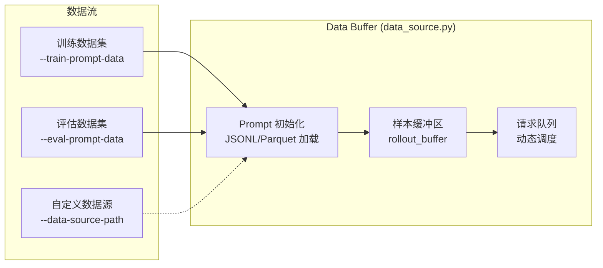

**支持的数据格式**：
- JSONL（`.jsonl`）
- Parquet（`.parquet`）
- 支持 Hugging Face datasets 格式

### 3.4 Ray 编排层

Ray 负责整个系统的分布式资源管理和进程编排。

```mermaid
graph TB
    subgraph RayCluster["Ray 集群"]
        HEAD[Ray Head Node]
        W1[Worker Node 1<br/>Training GPUs]
        W2[Worker Node 2<br/>Rollout GPUs]
        W3[Worker Node N]
    end

    subgraph PlacementGroups["Placement Groups"]
        PG_T[Training PG<br/>Megatron Actors]
        PG_R[Rollout PG<br/>SGLang Engines]
    end

    subgraph Actors["Ray Actors"]
        RM_ACT[RolloutManager<br/>@ray.remote]
        AG_ACT[ActorGroup<br/>@ray.remote]
        TA_ACT[TrainingActor<br/>@ray.remote]
        SGL_ACT[SGLangEngine<br/>@ray.remote]
    end

    HEAD --> W1
    HEAD --> W2
    HEAD --> W3
    PG_T --> W1
    PG_R --> W2
    PG_T --> AG_ACT
    PG_T --> TA_ACT
    PG_R --> RM_ACT
    PG_R --> SGL_ACT
```

**关键文件**：

| 文件 | 说明 |
|------|------|
| `slime/ray/rollout.py` | Ray RolloutManager（1485 行，核心编排） |
| `slime/ray/placement_group.py` | GPU Placement Group 创建 |
| `slime/ray/actor_group.py` | Actor Group 管理 |
| `slime/ray/train_actor.py` | Megatron 训练 Actor |

---

## 4. 训练主循环

### 4.1 主循环流程

```mermaid
flowchart TD
    START([开始]) --> PARSE[parse_args]
    PARSE --> PG_CREATE[create_placement_groups<br/>分配 GPU 资源]
    PG_CREATE --> INIT_TRACK[init_tracking<br/>初始化 WandB/TensorBoard]
    INIT_TRACK --> CREATE_RM[create_rollout_manager<br/>初始化 SGLang 引擎]
    CREATE_RM --> CREATE_MODEL[create_training_models<br/>初始化 Actor/Critic]
    CREATE_MODEL --> UW[actor_model.update_weights<br/>推送初始权重到 rollout]

    UW --> LOOP_START{rollout_id 循环<br/>start..num_rollout}

    LOOP_START --> EVAL_CHECK{eval_interval<br/>且 rollout_id==0?}
    EVAL_CHECK -- 是 --> EVAL1[rollout_manager.eval]
    EVAL_CHECK -- 否 --> GEN
    EVAL1 --> GEN

    GEN[rollout_manager.generate<br/>生成 rollout 数据] --> OFFLOAD_CHECK{offload_rollout?}
    OFFLOAD_CHECK -- 是 --> OFFLOAD[rollout_manager.offload]
    OFFLOAD_CHECK -- 否 --> TRAIN_CHECK
    OFFLOAD --> TRAIN_CHECK

    TRAIN_CHECK{use_critic?} -- 否 --> ACTOR_TRAIN[actor_model.async_train]
    TRAIN_CHECK -- 是 --> CRITIC_TRAIN[critic_model.async_train<br/>获取 value_refs]
    CRITIC_TRAIN --> ACTOR_TRAIN2[actor_model.async_train<br/>with value_refs]

    ACTOR_TRAIN --> SAVE_CHECK{should_save?}
    ACTOR_TRAIN2 --> SAVE_CHECK

    SAVE_CHECK -- 是 --> SAVE[save checkpoint]
    SAVE_CHECK -- 否 --> OFFLOAD2

    SAVE --> OFFLOAD2[offload_train<br/>清理训练内存]
    OFFLOAD2 --> UW2[actor_model.update_weights<br/>同步新权重到 rollout]
    UW2 --> EVAL_PERIODIC{eval_interval<br/>周期到?}
    EVAL_PERIODIC -- 是 --> EVAL2[rollout_manager.eval]
    EVAL_PERIODIC -- 否 --> LOOP_END

    EVAL2 --> LOOP_END{还有 rollout?}
    LOOP_END -- 是 --> LOOP_START
    LOOP_END -- 否 --> DISPOSE[rollout_manager.dispose]
    DISPOSE --> FINISH([finish_tracking 结束])

    style START fill:#4CAF50,color:#fff
    style FINISH fill:#4CAF50,color:#fff
    style GEN fill:#FF9800,color:#fff
    style ACTOR_TRAIN fill:#2196F3,color:#fff
    style ACTOR_TRAIN2 fill:#2196F3,color:#fff
    style EVAL1 fill:#9C27B0,color:#fff
    style EVAL2 fill:#9C27B0,color:#fff
```

### 4.2 单次 Rollout 内部流程

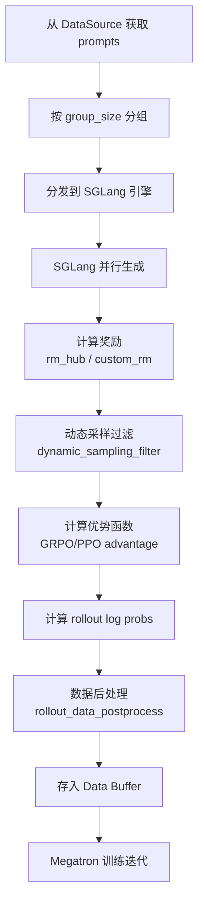

---

## 5. 核心数据类型

### 5.1 Sample 类

`Sample` 是 slime 中最核心的数据结构，贯穿 rollout → training 全流程。

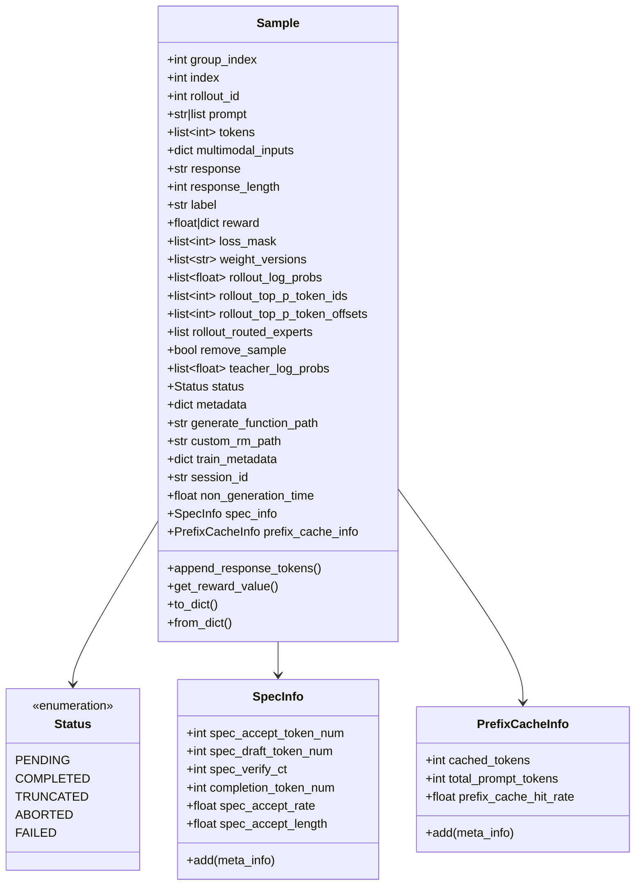

**关键字段说明**：

| 字段 | 类型 | 说明 |
|------|------|------|
| `group_index` | `int` | 在 group 内的索引（GRPO group sampling） |
| `rollout_id` | `int` | 同一个 rollout 执行产生的多个样本共享此 ID |
| `tokens` | `list[int]` | prompt + response 的完整 token 序列 |
| `loss_mask` | `list[int]` | 1=参与训练，0=不参与（如 tool 调用内容） |
| `rollout_log_probs` | `list[float]` | rollout 引擎产生的 log 概率（用于 off-policy 校正） |
| `rollout_top_p_token_ids` | `list[int]` | top-p 采样的候选 token（用于确定性重放） |
| `rollout_routed_experts` | `list` | MoE routing replay 专家路由信息 |
| `teacher_log_probs` | `list[float]` | 教师模型 log 概率（在线策略蒸馏用） |
| `weight_versions` | `list[str]` | 生成此样本时使用的权重版本（异步训练用） |

### 5.2 其他关键类型

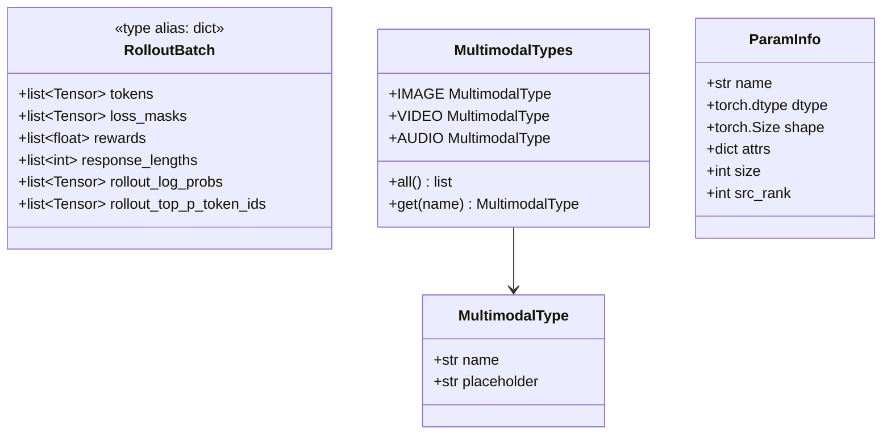

---

## 6. 定制化接口

slime 提供 17 个钩子点，覆盖从数据生成到训练的全流程。

### 6.1 接口总览

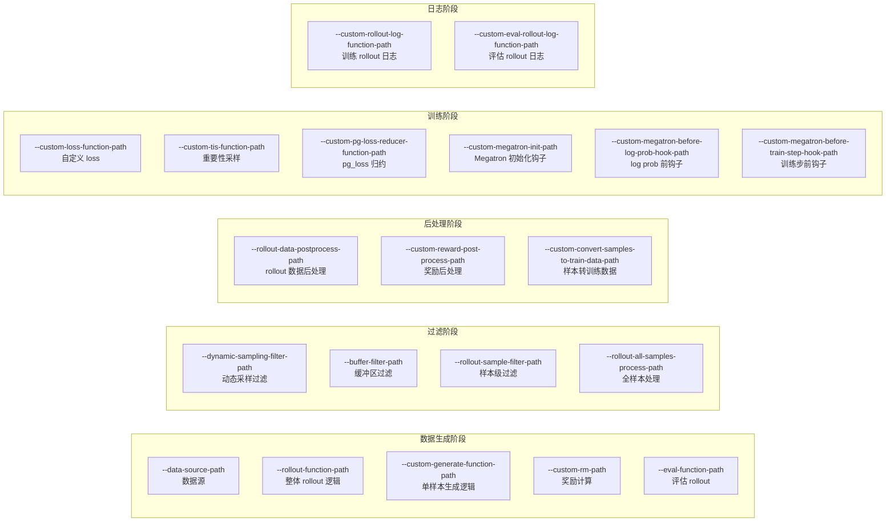

### 6.2 接口选择决策树

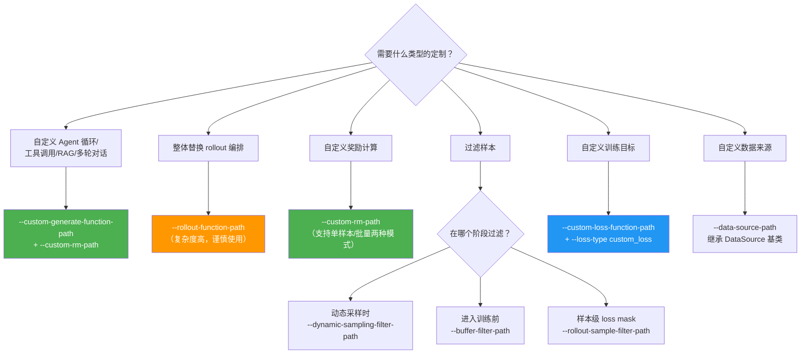

### 6.3 关键接口签名

```python
# 1. 自定义生成函数（最常用）
async def custom_generate(args, sample: Sample, sampling_params: dict) -> Sample | list[Sample]

# 2. 自定义奖励函数
async def custom_rm(args, sample: Sample) -> float
# 或批量模式（--group-rm 启用时）
async def batched_custom_rm(args, samples: list[Sample]) -> list[float]

# 3. 整体 rollout 函数
def generate_rollout(args, rollout_id, data_source, evaluation=False) -> RolloutFnTrainOutput | RolloutFnEvalOutput

# 4. 动态采样过滤
def filter_function(args, samples: list[Sample], **kwargs) -> DynamicFilterOutput

# 5. 自定义数据源（继承基类）
class CustomDataSource(DataSource):
    def get_samples(self, num_samples: int) -> list[list[Sample]]: ...
    def add_samples(self, samples: list[list[Sample]]): ...
    def save(self, rollout_id): ...
    def load(self, rollout_id=None): ...
    def __len__(self): ...
```

---

## 7. 部署模式

### 7.1 四种部署架构

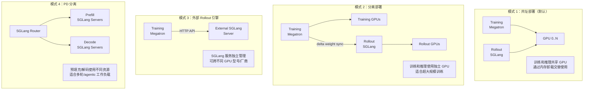

### 7.2 共址 vs 分离部署选择指南

| 场景 | 推荐模式 | 关键参数 |
|------|---------|----------|
| 中小规模模型（7B-70B） | 共址 | 默认配置 |
| 超大规模模型（>100B） | 分离 | `--delta-weight-sync` |
| 推理服务需独立管理 | 外部 | `--external-rollout-engines` |
| 长上下文多轮 agentic | PD 分离 | SGLang Config YAML |
| 混合 GPU 型号 | 外部 + 磁盘传输 | `--update-weight-via-disk` |

---

## 8. 高级特性

### 8.1 权重同步机制

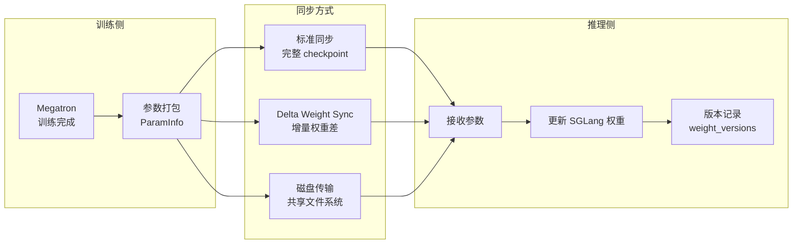

**Delta Weight Sync** 特别适合：
- 训练/推理分离部署
- 超大模型（减少传输量）
- 不同 GPU 型号之间同步

### 8.2 异步 Rollout（全异步模式）

适用于长尾 agentic 工作负载，部分样本可能需要远长于平均的生成时间。

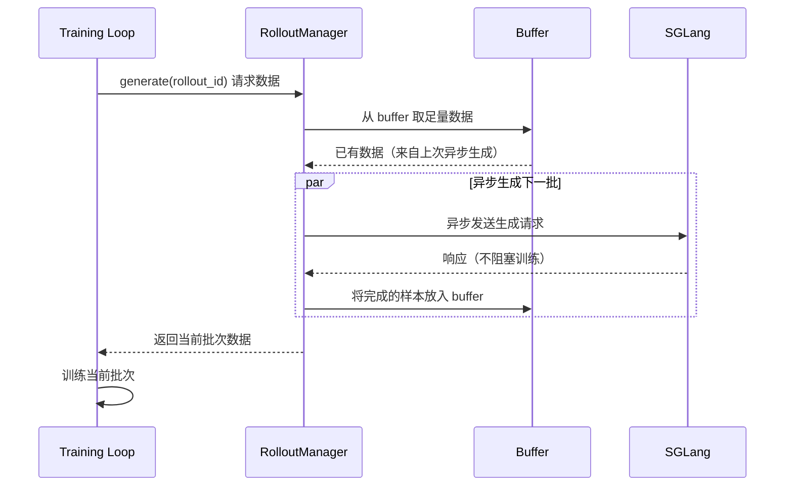

### 8.3 MoE Routing Replay

防止 MoE 模型 RL 训练中的路由不稳定问题。

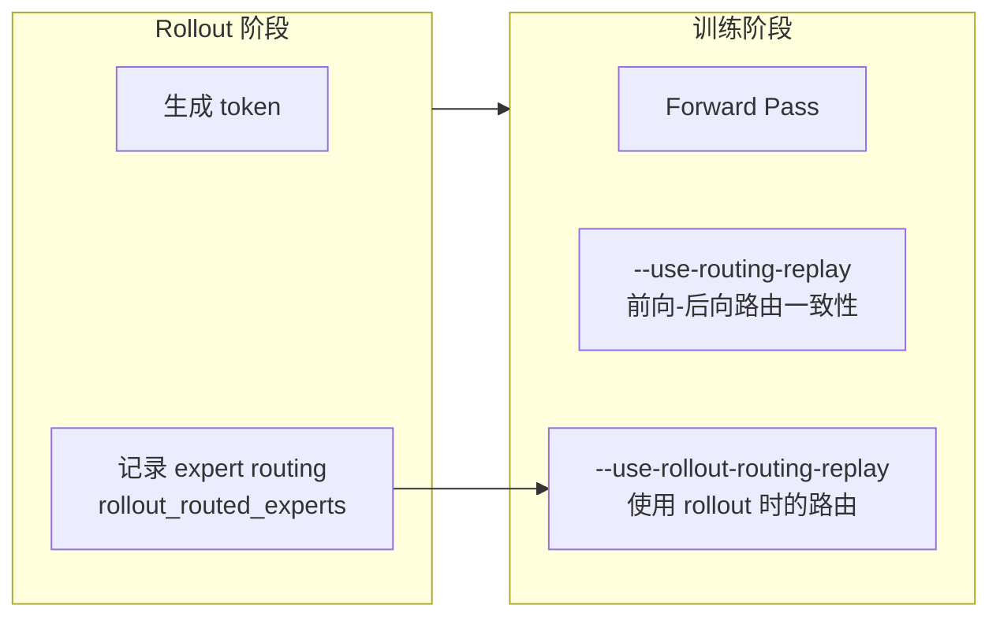

### 8.4 投机解码（Speculative Decoding）

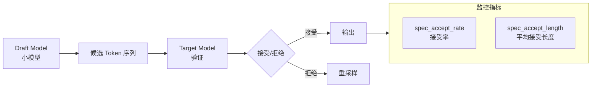

### 8.5 观测性体系

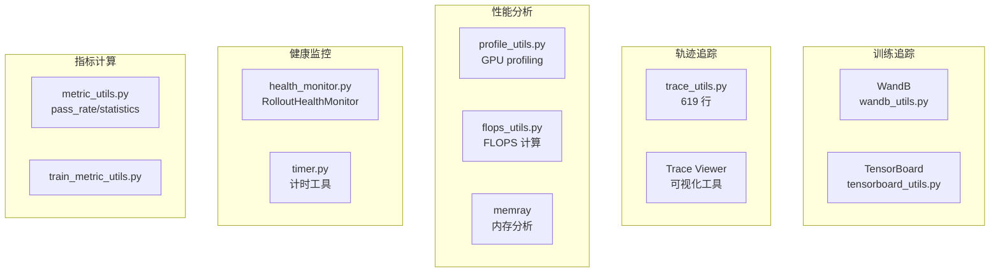

---

## 9. 插件系统

`slime_plugins/` 目录提供可扩展的插件架构：

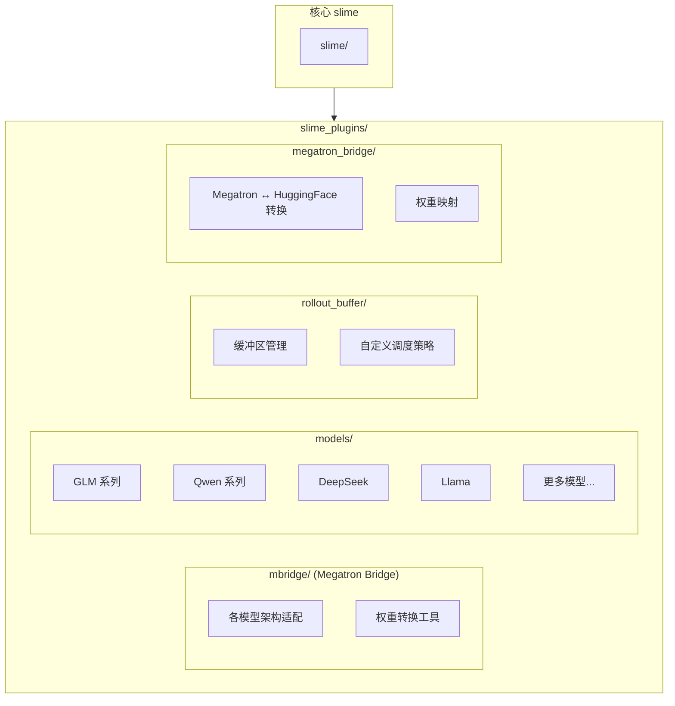

---

## 10. 生态项目

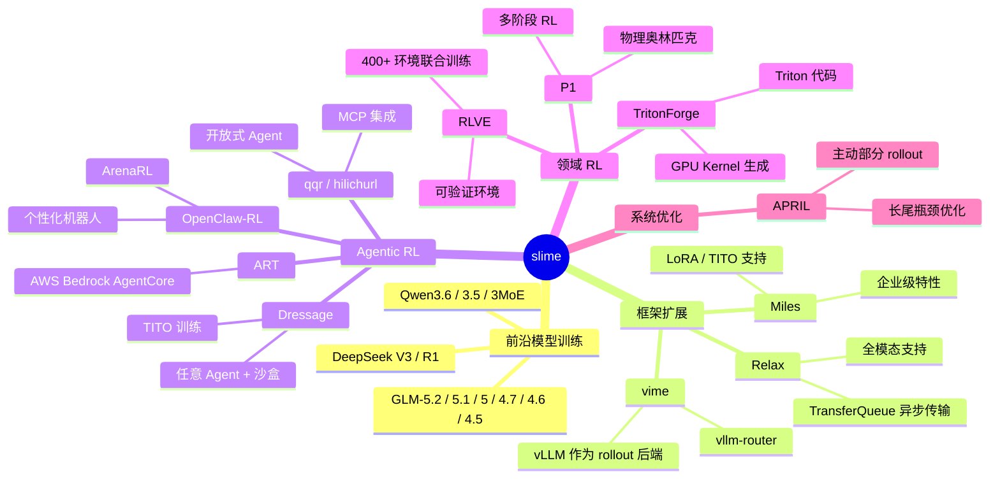

---

## 11. 配置指南

### 11.1 参数分类体系

```mermaid
graph TB
    subgraph Args["slime 参数体系"]
        MEG_ARGS[Megatron 原生参数<br/>直接传递]
        SGL_ARGS[SGLang 参数<br/>--sglang- 前缀]
        SLIME_ARGS[slime 专有参数<br/>slime/utils/arguments.py]
    end

    subgraph MEGExamples["Megatron 参数示例"]
        ME1[--tensor-model-parallel-size 2]
        ME2[--pipeline-model-parallel-size 4]
        ME3[--micro-batch-size 2]
        ME4[--global-batch-size 128]
    end

    subgraph SGLExamples["SGLang 参数示例"]
        SE1[--sglang-mem-fraction-static 0.8]
        SE2[--sglang-tp-size 2]
        SE3[--sglang-max-running-requests 256]
    end

    subgraph SLIMEExamples["slime 参数示例"]
        SL1[--num-rollout 1000<br/>总 rollout 步数]
        SL2[--group-size 8<br/>每 prompt 生成数]
        SL3[--rollout-function-path<br/>自定义 rollout]
        SL4[--rm-type math<br/>奖励类型]
        SL5[--save-interval 50<br/>保存间隔]
        SL6[--eval-interval 10<br/>评估间隔]
    end

    MEG_ARGS --> MEGExamples
    SGL_ARGS --> SGLExamples
    SLIME_ARGS --> SLIMEExamples
```

### 11.2 核心 slime 参数列表

| 参数类别 | 参数 | 说明 |
|---------|------|------|
| **训练规模** | `--num-rollout` | 总 rollout 步数 |
| | `--group-size` | 每个 prompt 生成的响应数（GRPO） |
| | `--max-response-length` | 最大响应长度 |
| **算法** | `--loss-type` | 损失类型（grpo/ppo/sft/custom_loss） |
| | `--use-critic` | 启用 Critic 模型（PPO） |
| | `--kl-coef` | KL 散度系数 |
| **奖励** | `--rm-type` | 内置奖励类型 |
| | `--custom-rm-path` | 自定义奖励函数路径 |
| | `--rm-url` | 远程奖励服务 URL |
| **数据** | `--train-prompt-data` | 训练 prompt 数据路径 |
| | `--eval-prompt-data` | 评估 prompt 数据路径 |
| | `--data-source-path` | 自定义数据源 |
| **定制化** | `--rollout-function-path` | 自定义 rollout 函数 |
| | `--custom-generate-function-path` | 自定义生成函数 |
| **持久化** | `--save-interval` | checkpoint 保存间隔 |
| | `--eval-interval` | 评估间隔 |
| **内存** | `--offload-train` | 训练时卸载（节省显存） |
| | `--offload-rollout` | rollout 时卸载 |

### 11.3 SGLang Config YAML（高级拓扑配置）

用于需要精细控制的复杂部署（如 PD 分离、多模型服务、异构集群）：

```yaml
# 示例：PD 分离配置
server_groups:
  - name: prefill
    tp_size: 4
    args:
      disaggregation_mode: prefill
      mem_fraction_static: 0.85
  - name: decode
    tp_size: 2
    args:
      disaggregation_mode: decode
      mem_fraction_static: 0.70
router:
  policy: session_affinity  # 多轮对话会话亲和性
```

---

## 12. 测试与 CI

### 12.1 测试层次结构

```mermaid
graph TB
    subgraph TestLevels["测试层次"]
        UNIT[CPU 单元测试<br/>无需 GPU]
        CONTRACT[契约测试<br/>定制化接口]
        E2E[端到端 GPU 测试<br/>完整训练循环]
    end

    subgraph UnitTests["单元测试内容"]
        U1[参数验证<br/>test_megatron_argument_validation.py]
        U2[类型系统测试<br/>Sample/RolloutBatch]
        U3[指标计算<br/>test_metric_report.py]
        U4[Loss 数值一致性<br/>test_loss_cp_invariance.py]
    end

    subgraph ContractTests["契约测试内容"]
        C1[test_plugin_rollout_contracts.py<br/>rollout-function-path]
        C2[test_plugin_generate_contracts.py<br/>custom-generate-function-path]
        C3[test_plugin_path_loading_contracts.py<br/>rm/filter/datasource 接口]
        C4[test_plugin_runtime_hook_contracts.py<br/>运行时钩子接口]
    end

    subgraph E2ETests["E2E 测试内容"]
        E1[Qwen2.5-0.5B 快速测试]
        E2[SGLang Config 测试]
        E3[全异步 Rollout 测试]
        E4[MoE 模型测试]
        E5[多轮对话测试]
        E6[OPD（在线策略蒸馏）测试]
        E7[PPO 测试]
        E8[checkpoint 保存/恢复]
    end

    UNIT --> UnitTests
    CONTRACT --> ContractTests
    E2E --> E2ETests
```

### 12.2 CI 流水线

```mermaid
flowchart LR
    PR[Pull Request] --> PRE[pre-commit<br/>black/isort/ruff]
    PRE --> CPU[CPU 单元测试<br/>run-ci-cpu-unittest]
    CPU --> GPU_LABEL{PR 标签判断}

    GPU_LABEL --> |run-ci-sglang-config| T1[SGLang Config 测试]
    GPU_LABEL --> |run-ci-async| T2[异步 Rollout 测试]
    GPU_LABEL --> |run-ci-disagg| T3[PD 分离测试]
    GPU_LABEL --> |run-ci-moe| T4[MoE 测试]
    GPU_LABEL --> |run-ci-multi-turn| T5[多轮测试]
    GPU_LABEL --> |run-ci-opd| T6[OPD 测试]

    T1 & T2 & T3 & T4 & T5 & T6 --> RESULT[CI 结果]

    style PRE fill:#FF9800,color:#fff
    style CPU fill:#4CAF50,color:#fff
    style RESULT fill:#2196F3,color:#fff
```

### 12.3 pytest 标记

| 标记 | 用途 |
|------|------|
| `unit` | CPU 单元测试 |
| `integration` | 集成测试 |
| `system` | 系统级测试 |
| `acceptance` | 验收测试 |
| `docs` | 文档测试 |
| `skipduringci` | CI 中跳过 |
| `pleasefixme` | 待修复的已知失败 |

---

## 13. 目录结构

```
slime/
├── train.py                    # 同步训练入口
├── train_async.py              # 异步训练入口
├── setup.py                    # 包配置（version 0.3.0）
├── pyproject.toml              # 项目元数据和工具配置
├── requirements.txt            # 依赖列表
│
├── slime/                      # 核心包
│   ├── __init__.py
│   ├── agent/                  # Agent 框架
│   │   ├── aiohttp_threaded.py
│   │   ├── sandbox.py
│   │   ├── trajectory.py
│   │   ├── parsing.py
│   │   ├── adapters/
│   │   └── harness/
│   │
│   ├── rollout/                # Rollout 数据生成
│   │   ├── sglang_rollout.py       # 主 rollout (609 行)
│   │   ├── sglang_streaming_rollout.py
│   │   ├── fully_async_rollout.py  # 全异步 rollout (256 行)
│   │   ├── sft_rollout.py
│   │   ├── on_policy_distillation.py
│   │   ├── data_source.py          # 数据源抽象 (229 行)
│   │   ├── forge_load.py
│   │   ├── base_types.py
│   │   ├── filter_hub/             # 样本过滤
│   │   │   ├── base_types.py
│   │   │   └── dynamic_sampling_filters.py
│   │   └── rm_hub/                 # 奖励模型
│   │       ├── deepscaler.py
│   │       ├── f1.py
│   │       ├── gpqa.py
│   │       ├── ifbench.py
│   │       ├── math_utils.py
│   │       └── math_dapo_utils.py
│   │
│   ├── ray/                    # Ray 分布式编排
│   │   ├── rollout.py              # RolloutManager (1485 行)
│   │   ├── placement_group.py      # GPU 资源分配
│   │   ├── actor_group.py
│   │   ├── train_actor.py
│   │   ├── utils.py
│   │   ├── rollout_validation.py
│   │   └── ray_actor.py
│   │
│   ├── backends/               # 后端实现
│   │   ├── megatron_utils/         # Megatron 工具集 (20+ 子模块)
│   │   │   ├── initialize.py
│   │   │   ├── arguments.py
│   │   │   ├── model.py
│   │   │   ├── actor.py
│   │   │   ├── checkpoint.py
│   │   │   ├── loss.py
│   │   │   ├── data.py
│   │   │   ├── cp_utils.py
│   │   │   ├── kernels/
│   │   │   ├── megatron_patch/
│   │   │   ├── megatron_to_hf/
│   │   │   └── update_weight/
│   │   └── sglang_utils/           # SGLang 工具集
│   │       ├── sglang_engine.py
│   │       ├── arguments.py
│   │       ├── sglang_config.py    # YAML 拓扑配置
│   │       ├── server_control.py
│   │       └── external.py
│   │
│   └── utils/                  # 工具集（32 模块，26K+ 行）
│       ├── arguments.py            # 统一参数解析
│       ├── types.py                # 核心类型（Sample 等）
│       ├── data.py                 # 数据集加载
│       ├── ppo_utils.py            # PPO 算法 (729 行)
│       ├── dp_schedule.py          # 数据并行调度
│       ├── seqlen_balancing.py     # 序列长度均衡
│       ├── mask_utils.py           # Token masking
│       ├── distributed_utils.py    # 多 GPU 协调
│       ├── reloadable_process_group.py
│       ├── async_utils.py
│       ├── http_utils.py           # HTTP 客户端
│       ├── trace_utils.py          # 轨迹追踪 (619 行)
│       ├── logging_utils.py
│       ├── tensorboard_utils.py
│       ├── wandb_utils.py
│       ├── health_monitor.py
│       ├── profile_utils.py
│       ├── metric_utils.py
│       ├── eval_config.py
│       ├── processing_utils.py     # 多模态处理
│       ├── memory_utils.py
│       ├── timer.py
│       ├── misc.py
│       └── ...
│
├── slime_plugins/              # 插件扩展
│   ├── mbridge/                # Megatron Bridge
│   ├── megatron_bridge/
│   ├── models/                 # 模型实现
│   └── rollout_buffer/
│
├── tests/                      # 测试套件 (59 文件)
│   ├── plugin_contracts/       # 接口契约测试
│   ├── test_agent/
│   └── test_*.py
│
├── examples/                   # 示例实现
│   ├── multi_agent/            # 多 agent rollout
│   ├── search-r1/              # 搜索增强多轮生成
│   ├── fully_async/            # 全异步 rollout
│   ├── coding_agent_rl/        # 代码 agent RL
│   ├── geo3k_vlm/              # 视觉语言模型
│   ├── tau-bench/              # TAU benchmark
│   └── ...
│
├── docs/
│   ├── en/                     # 英文文档
│   │   ├── get_started/        # 快速开始
│   │   ├── advanced/           # 高级特性
│   │   ├── developer_guide/    # 开发者指南
│   │   └── blogs/
│   └── zh/                     # 中文文档
│
├── docker/                     # Docker 配置
├── scripts/                    # 辅助脚本
└── tools/                      # 工具集（格式转换/分析）
```

---

## 技术栈总览

```mermaid
graph LR
    subgraph Training["训练"]
        ML[Megatron-LM<br/>分布式训练]
        PT[PyTorch<br/>基础框架]
    end

    subgraph Inference["推理"]
        SG[SGLang<br/>高性能推理]
        SGR[sglang-router<br/>负载均衡]
    end

    subgraph Orchestration["编排"]
        RAY[Ray<br/>分布式系统]
    end

    subgraph Data["数据"]
        HF[HuggingFace<br/>Transformers/Datasets]
        JSONL[JSONL/Parquet]
    end

    subgraph Monitor["监控"]
        WB2[Weights & Biases]
        TB3[TensorBoard]
        MR[memray<br/>内存分析]
    end

    subgraph Quality["代码质量"]
        BLK[black]
        ISO[isort]
        RUF[ruff]
        PRE[pre-commit]
        PT2[pytest]
    end

    Training --- Orchestration
    Inference --- Orchestration
    Orchestration --- Data
    Training --- Monitor
    Inference --- Monitor
```
---

*Wiki 基于 slime v0.3.0 生成 | 更新日期：2026-06-22*