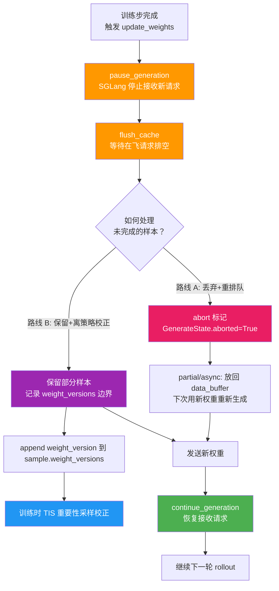
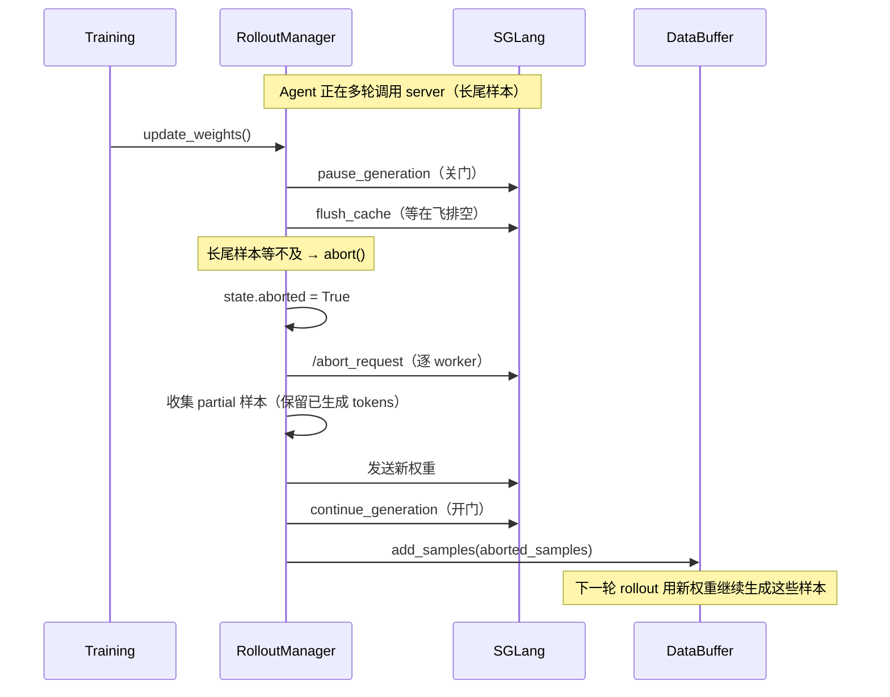
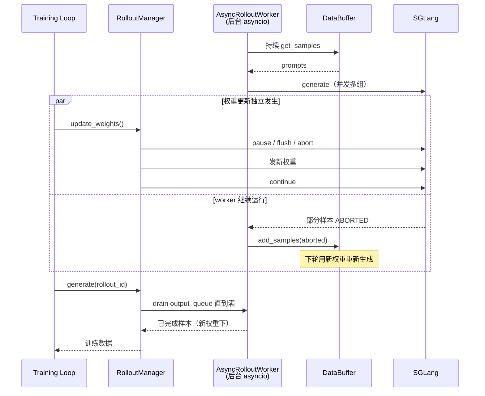
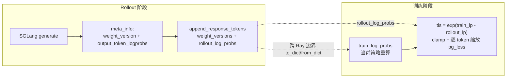
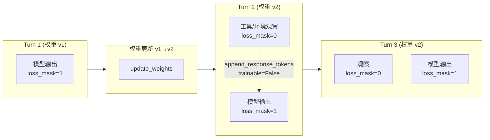

# 参数同步与在飞 Rollout 的交互

> 场景：在 partial rollout / agentic RL 中，agent 正在多轮调用 SGLang server 时，训练侧触发了 `update_weights`（参数同步）。框架如何处理？

涉及三层协作：**训练侧的 pause-flush-resume 协议**、**rollout 侧的 abort/requeue 策略**、**训练时的离策略（off-policy）校正**。

---

## 目录

1. [总览：两条路线](#1-总览两条路线)
2. [Pause-Flush-Resume 协议](#2-pause-flush-resume-协议所有同步后端通用)
3. [Partial Rollout：abort + 重排队](#3-partial-rolloutabort--重排队)
4. [Fully-Async Rollout：后台 worker + 自动重排队](#4-fully-async-rollout后台-worker--自动重排队)
5. [跨权重版本样本：weight_versions + TIS 校正](#5-跨权重版本样本weight_versions--tis-校正)
6. [Agentic 多轮：loss_mask 区分模型与环境 token](#6-agentic-多轮loss_mask-区分模型与环境-token)
7. [一致性校验：weight_version 双向核对](#7-一致性校验weight_version-双向核对)
8. [三种场景处理对照](#8-三种场景处理对照)
9. [设计哲学](#9-设计哲学)

---

## 1. 总览：两条路线



slime 实际上**两条路线都会用**，取决于模式：

- **partial / async rollout** 走"丢弃 + 重排队"
- **跨权重版本的保留样本**走"保留 + TIS 校正"

---

## 2. Pause-Flush-Resume 协议（所有同步后端通用）

无论用哪种权重传输方式（tensor IPC / disk / NCCL distributed / delta），`update_weights()` 的骨架完全一致：

```python
# update_weight_from_tensor.py:151-156 （delta/disk/distributed 同构）
@torch.no_grad()
def update_weights(self) -> None:
    self.weight_version += 1
    rank = dist.get_rank()
    if rank == 0:
        ray.get([engine.pause_generation.remote() for engine in self.rollout_engines])
        ray.get([engine.flush_cache.remote() for engine in self.rollout_engines])
    dist.barrier(group=get_gloo_group())
    # ... 实际传输权重 ...
    if rank == 0:
        ray.get([engine.continue_generation.remote() for engine in self.rollout_engines])
    dist.barrier(group=get_gloo_group())
```

三个阶段对应 SGLang 的三个 HTTP 端点（`slime/backends/sglang_utils/sglang_engine.py`）：

| 阶段 | HTTP 端点 | 行为 |
|------|----------|------|
| **pause** | `POST /pause_generation` | **停止接收新请求**，但允许在飞请求自然完成 |
| **flush** | `GET /flush_cache` | 等待所有在飞请求排空，清空 KV cache（60 秒重试循环） |
| **continue** | `POST /continue_generation` | 恢复接收新请求 |

```python
# sglang_engine.py:289-308 — flush_cache 重试循环
def flush_cache(self):
    if self.node_rank != 0:
        return
    for _ in range(60):
        try:
            response = requests.get(f"http://{self.server_host}:{self.server_port}/flush_cache")
            if response.status_code == 200:
                break
            time.sleep(1)
        except NewConnectionError:
            raise
        except Exception:
            time.sleep(1)
    else:
        raise TimeoutError("Timeout while flushing cache.")
```

> **关键语义**：`pause_generation` 不是"立即中断"，而是"关门"——已经在处理的请求会跑完。这保证了**不会出现一个 token 生成到一半权重被换掉**这种撕裂状态。`flush_cache` 负责等到所有在飞请求都跑完。

---

## 3. Partial Rollout：abort + 重排队

在 partial rollout 场景（部分样本远比平均长），等所有在飞请求自然排空会拖慢同步。slime 用 `abort()` 主动打断长尾样本，并把**已生成的部分**保留下来重新入队。

`slime/rollout/sglang_rollout.py:335-371` 的 `abort()`：

```python
async def abort(args, rollout_id) -> list[list[Sample]]:
    aborted_samples = []
    state = GenerateState(args)
    state.aborted = True  # 信号所有 pending 任务

    # HTTP 层：对每个 worker 调 /abort_request 直到 idle
    response = await get(f"http://{router}/workers")
    urls = [w["url"] for w in response["workers"]]
    await abort_servers_until_idle(urls)

    # 收集 partial 样本（仅 partial_rollout 模式）
    while state.pendings:
        done, state.pendings = await asyncio.wait(state.pendings,
                                                   return_when=asyncio.FIRST_COMPLETED)
        if not args.partial_rollout:
            continue
        for task in done:
            group = task.result()
            for sample in group:
                if sample.response and "start_rollout_id" not in sample.metadata:
                    sample.metadata["start_rollout_id"] = rollout_id
            aborted_samples.append(group)

    return aborted_samples
```

**生成任务内部会轮询 `state.aborted`**（`sglang_rollout.py:244-246`）：

```python
async with state.semaphore:
    if state.aborted:
        sample.status = Sample.Status.ABORTED
        return sample
```

被打断的样本被收集后**重新塞回 data_buffer**（`sglang_rollout.py:606-608`）：

```python
output, aborted_samples = run(generate_rollout_async(args, rollout_id, data_source.get_samples))
if aborted_samples:
    data_source.add_samples(aborted_samples)  # 下一轮用新权重接着生成
```

`Sample.Status` 专门为此设了 `TRUNCATED` 和 `ABORTED` 两个状态——`ABORTED` 表示"被权重同步打断，可重试"。



---

## 4. Fully-Async Rollout：后台 worker + 自动重排队

全异步模式（`slime/rollout/fully_async_rollout.py`）更进一步：一个**后台 asyncio worker** 持续从 `data_buffer` 取样本并生成，与训练循环**完全解耦**。权重更新时，worker 不需要显式协调——被打断的样本靠 `ABORTED` 状态自动回流。

```python
def _cb(done_task):
    result = done_task.result()
    # ABORTED 组 → 重排队，不送训练
    if any(getattr(s, "status", None) == Sample.Status.ABORTED for s in result):
        try:
            self.data_buffer.add_samples([result])
        except Exception:
            logger.exception("fully-async: failed to requeue aborted group")
        return
    self.output_queue.put((gid, result))
```

> 来自 `examples/fully_async/README.md:77-82`：  
> "Groups containing an `ABORTED` sample are pushed back into `data_buffer.add_samples` instead of being shipped to training."

**核心设计**：worker 对权重更新信号**无感知**，耦合点只在 `GenerateState.aborted` 这个共享标志。训练侧 `update_weights` 独立地 pause/flush/sync/resume，in-flight 样本被打断后自动 `ABORTED` → 自动重排队 → 下次用新权重重新生成。

### Fully-Async 工作流



---

## 5. 跨权重版本样本：weight_versions + TIS 校正

上面的 abort/requeue 是"丢弃重做"。但有些场景**不能重做**（agentic 长轨迹重新跑代价太大），或者样本已经在权重更新前完成了一部分——这时 slime 选择**保留样本并用离策略重要性采样校正**。

### 5.1 逐 token 块记录权重版本

`Sample.weight_versions` 是一个 list，**每次 SGLang generate 调用返回的 meta_info 里带 `weight_version` 时，就 append 一次**（`slime/utils/types.py:372-373`）：

```python
def _apply_meta_info(self, args, meta_info, ...):
    ...
    if "weight_version" in meta_info:
        self.weight_versions.append(meta_info["weight_version"])
```

这样一个样本的 token 序列就能标注出"哪段是 v1 生成的、哪段是 v2 生成的"：

```
Sample: [prompt | turn1_tokens(v1) | turn2_tokens(v2) | turn3_tokens(v2)]
weight_versions: ["v1", "v2", "v2"]
rollout_log_probs: [lp_v1...] + [lp_v2...] + [lp_v2...]
```

### 5.2 Streaming 模式：逐 SSE chunk 物化

`slime/rollout/sglang_streaming_rollout.py` 在**每个 SSE chunk** 上重建样本状态并 append，所以即便流式生成中途收到 abort 信号，样本也停在**精确的 chunk 边界**，partial tokens + `weight_versions` 完整保留：

```python
# 每个 chunk：从 base 重建 + append 当前 chunk
sample.tokens = list(base_tokens)
sample.response = base_response
# ... 重置其他字段 ...
sample.append_response_tokens(args, tokens=call_tokens, log_probs=call_log_probs,
                              trainable=True, meta_info=meta, ...)
if state.aborted:  # 每个 chunk 检查 abort
    break
```

### 5.3 训练时：TIS 重要性采样

跨权重版本的样本是**离策略（off-policy）**的——token 是用旧策略采的，但要用新策略算 loss。slime 用 TIS（Truncated Importance Sampling）校正（`slime/backends/megatron_utils/loss.py:827-874`）：

```python
def vanilla_tis_function(args, *, pg_loss, train_log_probs, rollout_log_probs, loss_masks, **kwargs):
    rollout_log_probs = torch.cat(rollout_log_probs, dim=0)  # 生成时的 log π_old
    old_log_probs = torch.cat(train_log_probs, dim=0)        # 当前策略的 log π_train
    tis = torch.exp(old_log_probs - rollout_log_probs)       # 重要性比 e^(logπ_new - logπ_old)
    tis_weights = torch.clamp(tis, min=args.tis_clip_low, max=args.tis_clip)
    pg_loss = pg_loss * tis_weights  # 逐 token 缩放策略 loss
    return pg_loss, loss_masks, metrics
```

相关参数：

| 参数 | 作用 |
|------|------|
| `--use-tis` | 启用 TIS |
| `--tis-clip 5.0` | 重要性比上界裁剪 |
| `--tis-clip-low 0.05` | 重要性比下界裁剪 |
| `--custom-tis-function-path` | 自定义校正函数 |
| `--get-mismatch-metrics` | 记录逐 token TIS 统计 |

`rollout_log_probs` 来自生成时 SGLang 的 `meta_info["output_token_logprobs"]`，按 token 块对齐 `weight_versions`——所以即使一个样本横跨 v1/v2/v3，每段 token 都有对应版本的 log prob，TIS 逐 token 校正。

### 5.4 TIS 数据流



---

## 6. Agentic 多轮：loss_mask 区分模型与环境 token

agentic RL 里一个样本横跨多轮，每轮一次 server 调用。`examples/coding_agent_rl/README.md:143-172` 描述的契约：



- **模型生成的 token**：`append_response_tokens(trainable=True)` → `loss_mask=1`，需要 rollout log probs
- **工具/环境返回的 token**：`append_response_tokens(trainable=False)` → `loss_mask=0`，不参与 loss，不需要 log probs

`TrajectoryManager` 负责把后续 prompt（工具观察、compact 消息）路由到已保存的 token 流上：新 prompt 后缀若不匹配早期采样输出，未匹配部分被丢弃。这保证 `weight_versions` 精确标记了策略变更边界。

`append_response_tokens` 的 trainable 校验（`slime/utils/types.py`）：

```python
def append_response_tokens(self, args=None, *, tokens=None, log_probs=None,
                           trainable=True, meta_info=None, ...):
    if tokens and trainable and log_probs is None:
        raise ValueError("trainable response tokens require rollout log probabilities.")
    if tokens and not trainable:
        if log_probs is not None:
            raise ValueError("non-trainable response tokens should not pass rollout log probabilities.")
        log_probs = [0.0] * len(tokens)
    # ...
    self.loss_mask += [1 if trainable else 0] * len(tokens)
```

---

## 7. 一致性校验：weight_version 双向核对

更新后 CI 测试会**随机抽查一个引擎**，确认它记录的版本与训练侧一致（`slime/backends/megatron_utils/actor.py`）：

```python
if self.args.ci_test and len(rollout_engines) > 0 and self.weight_updater.weight_version > 0:
    engine = random.choice(rollout_engines)
    engine_version = ray.get(engine.get_weight_version.remote())  # GET /get_weight_version
    if str(engine_version) != str(self.weight_updater.weight_version):
        raise RuntimeError(f"Weight version mismatch! Engine: {engine_version}, ...")
```

`get_weight_version` 对应 SGLang 端点：

```python
# sglang_engine.py:349-355
def get_weight_version(self):
    url = f"http://{self.server_host}:{self.server_port}/get_weight_version"
    response = requests.get(url)
    return response.json()["weight_version"]
```

---

## 8. 三种场景处理对照

| 场景 | in-flight 样本处理 | 跨版本样本 | 校正方式 |
|------|------------------|-----------|---------|
| **标准同步 rollout** | `pause` 后等自然排空（flush_cache 60s） | 一般不出现（一批内权重不变） | 不需要 |
| **Partial rollout** | `abort()` 打断长尾，partial tokens 保留并重排队 | 重排队后用新权重从头生成 | 重新生成，无需校正 |
| **Fully-async rollout** | 后台 worker 无感知，`ABORTED` 自动回流 data_buffer | 同上，重排队 | 重新生成 |
| **Agentic 多轮（保留模式）** | 不打断，让多轮跑完 | `weight_versions` list 标记每轮边界 | TIS 逐 token 重要性采样 |
| **Streaming** | 每个 SSE chunk 检查 abort，停在 chunk 边界 | `weight_versions` 逐 chunk append | TIS |

---

## 9. 设计哲学

1. **门控而非中断**：`pause_generation` 是"关门"，在飞请求自然完成，避免权重撕裂。
2. **样本自描述**：`weight_versions` + `rollout_log_probs` + `loss_mask` 三者让一个样本完整携带"我是用哪些权重、在哪些 token 上、哪些参与训练"的全部信息，跨 Ray 边界（`to_dict`/`from_dict`）不丢失。
3. **可丢弃 vs 可保留**：短样本优先重做（简单、无偏）；长 agentic 轨迹优先保留 + TIS 校正（避免重跑代价）。
4. **解耦**：fully-async worker 不直接监听权重更新，只靠 `GenerateState.aborted` 共享标志间接耦合。

---

## 关键代码索引

| 机制 | 文件 | 位置 |
|------|------|------|
| pause/flush/resume 协议 | `slime/backends/megatron_utils/update_weight/update_weight_from_tensor.py` | 151-189 |
| SGLang HTTP 端点封装 | `slime/backends/sglang_utils/sglang_engine.py` | 289-308, 349-355, 471-479 |
| abort + partial 样本收集 | `slime/rollout/sglang_rollout.py` | 244-246, 335-371, 606-608 |
| GenerateState.aborted 标志 | `slime/rollout/sglang_rollout.py` | 83-135 |
| Fully-async worker 重排队 | `slime/rollout/fully_async_rollout.py` | 118-189 |
| weight_versions 记录 | `slime/utils/types.py` | 120, 372-373 |
| Streaming 逐 chunk 物化 | `slime/rollout/sglang_streaming_rollout.py` | 114-156 |
| TIS 重要性采样 | `slime/backends/megatron_utils/loss.py` | 827-874 |
| 版本一致性 CI 校验 | `slime/backends/megatron_utils/actor.py` | weight_version 检查段 |
| Agentic 多轮契约 | `examples/coding_agent_rl/README.md` | 143-177 |

---

*文档基于 slime v0.3.0 源码整理 | 更新日期：2026-06-22*
